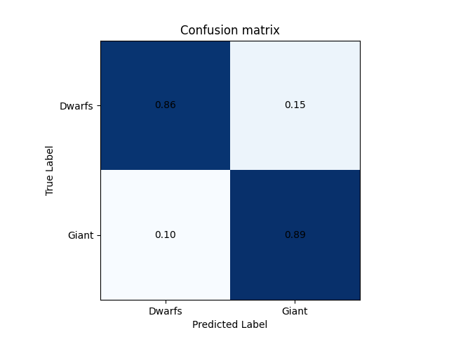

# Neural network Tarea 1

## Guitar Chords finger positions Data Description

This data set was taken from the UCI archive (https://archive.ics.uci.edu/ml/datasets/Guitar+Chords+finger+positions).

## Stars Data Description
This data set was taken from kaggle (https://www.kaggle.com/vinesmsuic/star-categorization-giants-and-dwarfs).
This set is focus on the star classification, based on the B-V color index and the absolute magnitude we can 
determine if an star is dwarf or giant.
This data set has 7 columns: apparent magnitude, distance to the star (stellar paralax), standard error of the before mentioned, B-V color index, spectral type (this column was dropped because shows more than 3000 different classes, what means a huge one-hot table), absolute magnitude and, the last one, TargetClass shows binary options (0:Dwarf or 1:Giant).

The page offers two dataset. On the one hand we have 3642 rows (we used to test our neural network) but on the other we have 39552 rows

## About the neural network
Based on the neural network given in class we created the class NeuralNetwork (is basically the same but as a class).

## Results of Stars dataset

After 2000 epochs, with 80% of the set for trainning and the other 20% of the data set for testing, without normalizing the data set and trainning directly (without cross validation method), we got the following results:

Precision of Dwarfs is 89.22%

Precision of Giant is 85.91%

Recall of Dwarfs is 85.72%

Recall of Giant is 89.37%

After 2000 epochs, with 80% of the set for trainning and the other 20% of the data set for testing, applying the cross validation method and 
without normalization, we got the following results:

Precision of Dwarfs is 88.85%

Precision of Giant is 85.88%

Recall of Dwarfs is 85.13%

Recall of Giant is 89.44%

